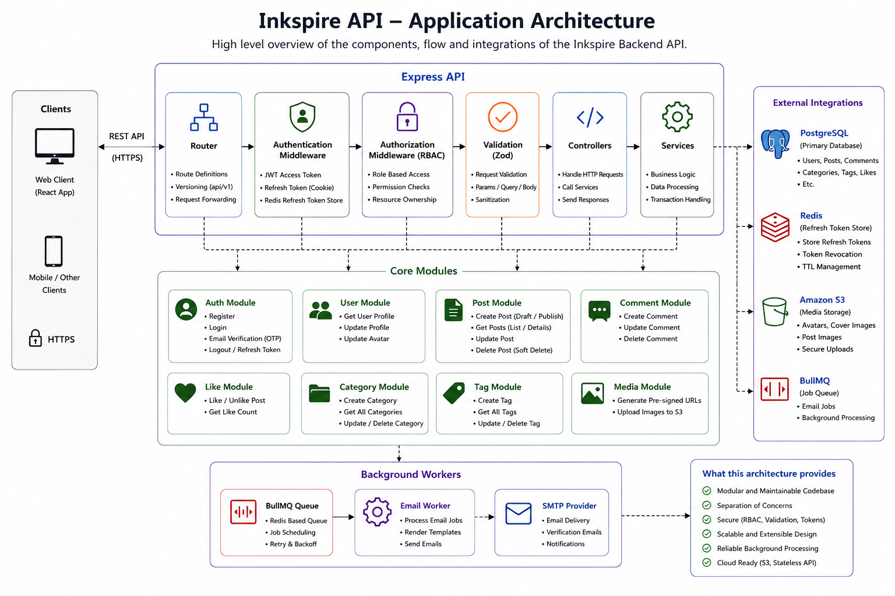

# Inkspire API

A production-style REST API powering **Inkspire**, a modern blogging platform. The API provides authentication, user management, blog publishing, media uploads, comments, likes, categories, tags, and administrative features while following a modular architecture with Prisma ORM, PostgreSQL, Redis, BullMQ, and AWS S3.

> **Repository:** Pair this project with the [Inkspire Client](https://github.com/AyushShende25/blog-client).

**Live links**:  [inkspire.fullstackprojects.dev](https://inkspire.fullstackprojects.dev)   [api.inkspire.fullstackprojects.dev](https://api.inkspire.fullstackprojects.dev)

---

## Architecture

### Infrastructure


### Application


---

## Tech Stack

| Category | Technology |
|----------|------------|
| Runtime | Node.js (>=24.12.0) |
| Framework | Express 5.x |
| Database | PostgreSQL 17 |
| ORM | Prisma 7.x |
| Queue/Cache | Redis + BullMQ |
| Authentication | JWT + bcryptjs |
| Validation | Zod |
| Email | Nodemailer Mailtrap |
| File Storage | AWS S3 + Coudfront + Route53 | 
| Logging | Winston Morgan |
| Security | Helmet, CORS, HPP, express-rate-limit, sanitize-html |
| Formatter/Linter | Biome |
| Bundler | tsup |
| Containerization | Docker, Docker-Compose |
| Cloud | AWS |
| Iac | Terraform |

---

## Features

### Authentication & Authorization
- Email/password authentication
- JWT access & refresh token authentication
- Refresh token management with Redis
- Secure HTTP-only cookies
- Email verification via OTP
- Role-based access control (RBAC)
- Route authorization middleware
- Permission-based authorization system

---

### Blog Management

- Create, update and delete posts
- Draft & publish workflow
- Rich text content support
- Automatic slug generation
- Post bookmarking
- Post likes
- Soft deletion
- Pagination & filtering

---

### Comments

- Create comments
- Edit comments
- Delete comments
- Permission-based access
- Nested replies with recursive CTEs

---

### Categories & Tags

- CRUD operations
- Associate posts with categories
- Associate posts with tags

---

### Media

- Generate pre-signed S3 upload URLs
- Secure image uploads
- Cover image support
- Rich text embedded images

---

### User Management

- User profiles
- Avatar uploads
- Profile updates
- Administrative user management

---

### Social Features
- Like posts
- Follow/unfollow users

---

### Background Jobs

- BullMQ job queues
- Email worker
- Email verification
- Queue-based email processing

---

### Security

- Helmet
- CORS
- HPP Protection
- Rate Limiting
- Request Validation (Zod)
- Password Hashing (bcrypt)
- HTML Sanitization

---


## Project Structure

```text
src
├── authorization/        # RBAC permissions
├── config/
├── errors/
├── jobs/
│   └── email/
├── libs/
│   ├── db.ts
│   ├── redis.ts
│   ├── s3.ts
│   └── logger.ts
├── middleware/
├── modules/
│   ├── auth/
│   ├── users/
│   ├── post/
│   ├── comments/
│   ├── media/
│   ├── likes/
│   ├── categories/
│   └── tags/
├── store/
└── utils/
```

---

# Core Modules

| Module | Description |
|----------|-------------|
| Authentication | Login, registration, refresh tokens, email verification |
| Users | User profile & management |
| Posts | Blog publishing & management |
| Comments | Comment system |
| Likes | Post likes |
| Categories | Category management |
| Tags | Tag management |
| Media | S3 uploads |

---

# Background Workers

The project separates long-running tasks from the API using **BullMQ** workers.

Current worker:

- Email Queue
  - Email verification
  - Transactional emails

---

# Getting Started

## Prerequisites

- Node.js 24+
- PostgreSQL
- Redis
- AWS S3 Bucket

---

## Installation

```bash
git clone https://github.com/AyushShende25/blog-api.git

cd blog-api

npm install
```

---

# Environment Variables

Create a `.env` file.

```env
DATABASE_URL=

REDIS_URL=

JWT_ACCESS_SECRET=
JWT_REFRESH_SECRET=

AWS_ACCESS_KEY_ID=
AWS_SECRET_ACCESS_KEY=
AWS_REGION=
AWS_BUCKET_NAME=

SMTP_HOST=
SMTP_PORT=
SMTP_USER=
SMTP_PASS=

CLIENT_URL=
```

---

# Database

Generate Prisma Client

```bash
npm run db:generate
```

Deploy migrations

```bash
npm run db:migrate
```

---

# Development

API

```bash
npm run dev
```

Worker

```bash
npm run dev:worker
```

---

# Production

Build

```bash
npm run build
```

Start API

```bash
npm start
```

Start Worker

```bash
npm run start:worker
```

---

### With Docker

1. **Create environment file**

```bash
cp .env.example .env.docker
```

3. **Start infrastructure**

```bash
docker compose up -d
```

---

# Scripts

| Command | Description |
|----------|-------------|
| `npm run dev` | Development server |
| `npm run dev:worker` | Development email worker |
| `npm run build` | Build application |
| `npm start` | Start API |
| `npm run start:worker` | Start worker |
| `npm run db:generate` | Generate Prisma Client |
| `npm run db:migrate` | Deploy migrations |
| `npm run format` | Format code |
| `npm run lint` | Lint code |
| `npm run check` | Run Biome checks |

---

# API Highlights

- RESTful API design
- Layered architecture (Router → Controller → Service)
- Centralized error handling
- Custom error classes
- Request validation with Zod
- Structured logging
- Redis-backed refresh token storage
- Background job processing
- S3 pre-signed uploads
- Role-based authorization
- Granular Permissions

---

# Related Projects

- **Frontend:** https://github.com/AyushShende25/blog-client
- **Infra:** https://github.com/AyushShende25/blog-infra

---

